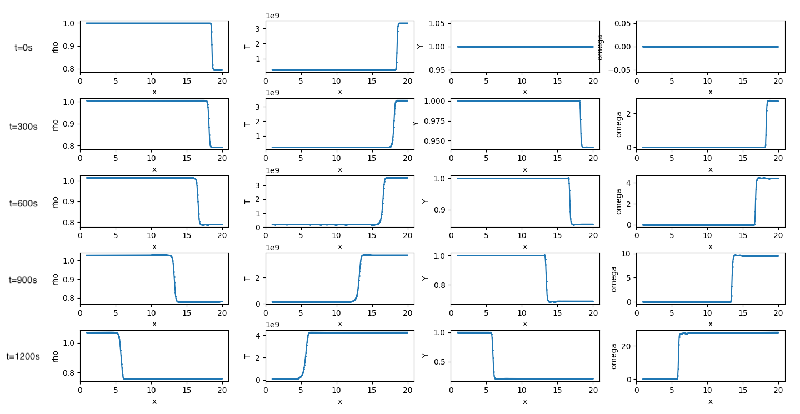
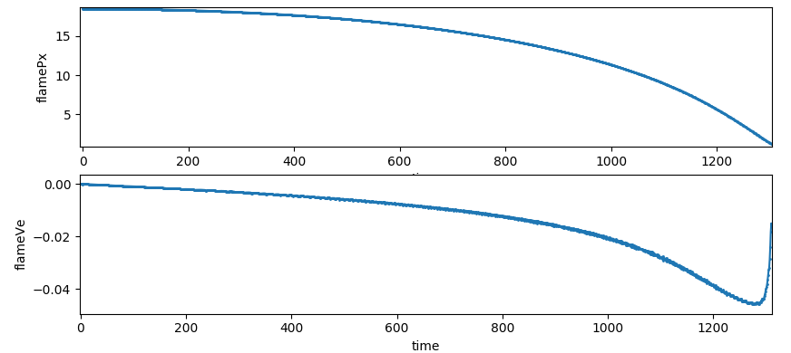
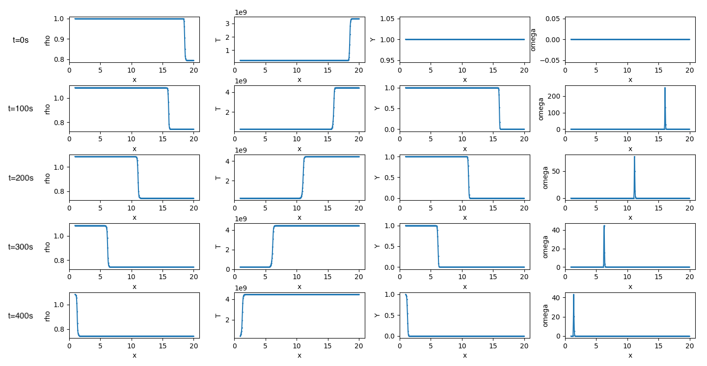
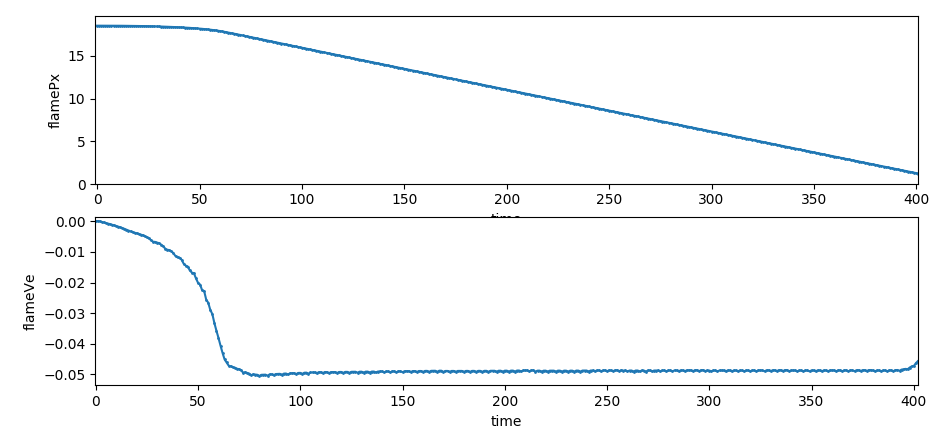

<h2 align=center>Spherical Inward Propagating Flame of Type Ia Supernova</h2>

<script type="text/javascript" src="http://cdn.mathjax.org/mathjax/latest/MathJax.js?config=default"></script>

#### 1. Introduction

Supernova represent the catastrophic explosions that mark the end of the life of some stars. The ejected mass is of order 1 to 10 solar masses with bulk velocities ranging from a few thousand to a few tens of thousands of km/s.[^1] The traditional single Chandrasekhar mass C–O White Dwarf burning is still considered to be responsible for a large population of type Ia supernova (SN Ia). Specifically, one of the key issues in its modeling is related to the flame acceleration and deflagration-detonation transition (DDT), with flame front instabilities being considered as a possible mechanism in driving the acceleration. The perspective of this proposal is to give a set of solutions of this problem. The milestones of this project are planed to be:

​	(a) Complete a set of code that can solve the simplest reacting flow in SN Ia conditions.

​	(b) Try to observe spherical flame acceleration with large Lewis number curvature effect.

​	(c) Try to observe deflagration-detonation transition (DDT) in (b).

#### 2. Basic Equations

+ Control equations of 1D, spherical coordinates:
    * Continuity Equation:
      
      $$
      \frac{\partial \hat \rho}{\partial \hat t}+\frac{\partial (\hat \rho u)}{\partial \hat r}+\frac{2(\hat \rho \hat u)}{\hat r}=0
      $$

    * Momentum Equation:
      
      $$
      \frac{\partial (\hat \rho \hat u)}{\partial \hat t}+\frac{\partial (\hat \rho \hat u^2+\hat P)}{\partial \hat r}+\frac{2(\hat \rho \hat u^2)}{\hat r}=0
      $$

    * Energy Equation:

      $$
      \frac{\partial (\hat \rho \hat E_s)}{\partial \hat t}+\frac{\partial (\hat \rho \hat u \hat E_s +\hat u \hat P)}{\partial \hat r}+\frac{2(\hat \rho \hat u \hat E_s + \hat u \hat P)}{\hat r}= \lambda\frac{\partial^2\hat T}{\partial \hat r^2}+\frac{2\lambda}{\hat r}\frac{\partial \hat T}{\partial \hat r}
      $$

    * Convection Diffusion Equation:
      
      $$
      \frac{\partial (\hat \rho \hat Y)}{\partial \hat t}+\frac{\partial (\hat \rho \hat u \hat Y)}{\partial \hat r} + \frac{2(\hat \rho \hat u \hat Y)}{\hat r}=\frac{\partial}{\partial \hat r}(\hat \rho D \frac{\partial \hat Y}{\partial \hat r})+\frac{2\hat \rho D}{\hat r}\frac{\partial \hat Y}{\partial \hat r}-\hat \omega
      $$

    * Equation of Reaction:
      
      $$
      \hat \omega = A \hat \rho^k \hat Y^2 \exp({\frac{-\hat E_a}{\hat T_9^{\frac{1}{3}}}})
      $$

    * Equation of State:

      $$
      \hat E_{(\rho,T)}=\frac{3}{4{\hat \rho}}(3\pi^2)^{1/3} \hbar c_1({\hat \rho}N)^{4/3} + \frac{1}{2} N \frac{(3\pi^2)^{2/3}}{3 \hbar c_1}(\frac{1}{{\hat \rho} N})^{1/3} (k{\hat T})^2
      $$
      
      $$ \hat E_s = \hat E_{(\rho,T)}+\frac{1}{2}\hat u^2+q\hat Y$$

      $$\hat  P = \frac{\hat \rho \hat E_{(\rho,T)}}{3} $$

#### 3. Dimensionless Equations

| Dimensionless variables | Reference values |
|--------------------|---------|
| $ \rho = \frac{\hat{\rho}}{\hat{\rho_0}} $                     |  $ \hat{\rho_0} = 3.5*10^{10} kg/m^3 $ |
| $ u  = \frac{\hat u}{\hat{u_0}} $                                  | $ \hat{u_0} = C_t S_c,  S_c = 466m/s $ (laminar flame speed) |
| $ t  = \frac{\hat t}{\hat{t_0}} $                                     | $ \hat{t_0} =\frac{\delta_f}{\hat u_0}, \frac{\delta_f}{S_c}=1.93*10^{-6} s $ |
| $ E = \frac{\hat E}{\hat E(\hat{T_b},\hat{\rho_0})} $  | $\hat E(\hat{T_b},\hat{\rho_0})=\frac{3}{4\hat{\rho_0}}(3\pi^2)^{1/3}\hat hc_1(N\hat{\rho_0})^{4/3} + \frac{1}{2} N \frac{(3\pi^2)^{2/3}}{3\hat h c_1}(\frac{1}{\hat{\rho_0} N})^{1/3} (k \hat{T_b})^2 = 6.1927*10^{13}J $ |
| $ T = \frac{\hat T-\hat{T_0}}{\hat T_{ad}-\hat{T_0}}$ | $ \hat{T_0}=1*10^8 K;  \hat{T_{ad}}=3.2*10^9 K $ |
| $ Y = \frac{\hat Y}{\hat{Y_0}} $                                  | $ \hat{Y_0} = 1 $ |
| $ r = \frac{\hat r}{\hat {r_0}} $                                    | $ \hat {r_0} = \delta_f = \frac{\lambda}{\rho_0 C_p S_c}=9*10^{-4} m $ |
| $ \omega = \frac{\hat \omega}{\hat {\omega_0}} $    | $ \hat {\omega_0} = \frac{\hat{\rho_0}\hat{Y_0}S_c}{\delta_f}= \hat \omega(\hat {Y_0},\hat{T_0},\hat{\rho_0}) $ |
| $ P =  \frac{\hat P}{\hat{P_0}} $                                 | $ \hat{P_0} = \frac{\hat{\rho_0}{\hat E(\hat{T_b},\hat{\rho_0})}}{3} $ |

Consider velocity dimensionless with sound speed $A_1=\hat E(\hat{\rho_0},\hat{T_b})/\hat u_0^2=1$

Enthalpy per unit is $ \text{qcon} = \frac{\lambda(\hat {T_b}-\hat{T_0})}{\hat{\rho_0}S_c\delta_f \hat E(\hat{\rho_0},\hat{T_b}) } = \frac{E(\hat{\rho_0},\hat{T_b})-E(\hat{\rho_0},\hat{T_0})}{E(\hat{\rho_0},\hat{T_b})} = 0.21811 $

Another constant $A_2=\text{qcon}\times S_c/\hat u_0=1.460\times10^{-5}$

+ Governing Equations:

  - Continuity Equation:
    $$
    \frac{\partial \rho}{\partial t}+(\frac{\partial}{\partial r} + \frac{2}{r})(\rho u)=0
    $$

  - Momentum Equation:
    $$
    \frac{\partial (\rho u)}{\partial t}+\frac{\partial}{\partial r}(\rho u^2+\frac{A_1P}{3})+\frac{2\rho u^2}{r}= 0
    $$

  - Energy Equation:
    $$
    \frac{\partial (\rho E_s)}{\partial t}+(\frac{\partial}{\partial r} + \frac{2}{r})(\rho u E_s + \frac{uP}{3})= (\frac{\partial}{\partial r} + \frac{2}{r})(A_2\frac{\partial T}{\partial r})
    $$

  - Convection Diffusion Equation:
    $$
    \frac{\partial (\rho Y)}{\partial t}+(\frac{\partial}{\partial r} + \frac{2}{r})(\rho u Y)=(\frac{\partial}{\partial r} + \frac{2}{r})(\frac{\rho}{Le_0C_t}\frac{\partial Y}{\partial r})-\frac{1}{C_t}\omega
    $$

  - Equation of Reaction:
    $$
    \omega = \rho Y exp({\frac{-Ea}{T_9^{\frac{1}{3}}}-\frac{-Ea}{{{T_b}_9}^{\frac{1}{3}}}})
    $$

  - Equation of State:
    $$ P = \rho E_{(\rho,T)} $$
    $$ E_s = E_{(\rho,T)}+\frac{1}{2}u^2+qY = \frac{E(\hat \rho,\hat T)}{E(\hat{\rho_0},\hat{T_b})}+\frac{1}{2A_1}u^2+qcon Y $$

#### 4. Code setting

+ Equations for programming:

$$
U = (\rho,\rho u,\rho E_s,\rho Y)
$$

$$
F = (\rho u, \rho u^2+\frac{A_1 P}{3},\rho u E_s + \frac{uP}{3},\rho u Y)
$$

$$
 G = (\rho u, \rho u^2,\rho u E_s + \frac{uP}{3},\rho u Y)
$$

$$
D = (0,0,A_2\frac{\partial T}{\partial r},\frac{\rho}{Le_0 C_t}\frac{\partial Y}{\partial r})
$$

$$
 S = (0,0,0,-\frac{\omega}{C_t})
$$

$$
\frac{\partial U}{\partial t}+\frac{\partial F}{\partial r} + \frac{2G}{r} = \frac{\partial D}{\partial r}+\frac{2D}{r} + S
$$

+ Discrete methods:

  + Time evolution: 3 order TVD `Runge-Kutta`

    $$ U^{(1)} = U_n + L(U_n) \Delta t $$
    $$ U^{(2)} = \frac{3}{4}U_n + \frac{1}{4}(U^{(1)} + L(U^{(1)}) \Delta t) $$
    $$ U_{n+1} = \frac{1}{3}U_n + \frac{2}{3}(U^{(2)} + L( U^{(2)})\Delta t)  $$

  + Convection term:

    `Roe` method: solve convection flux by eigen vector

  + Diffusion term: 7 order central difference
    $$
    \frac{\partial m_i}{\partial x} = \frac{1}{60}m_{i+3}-\frac{9}{60}m_{i+2}+\frac{45}{60}m_{i+1}-\frac{45}{60}m_{i-1}+\frac{9}{60}m_{i-2}-\frac{1}{60}m_{i-3}
    $$

+ Initial conditions:

  + Pressure: whole field the same pressure $\hat P(\rho_0, T_0)/\hat P_0$
  + Velocity: near zero (can not set zero beacuse of Roe method eigen vector has 1/velocity)
  + Concentration: $Y_0=1$
  + Temperature: $T_0 \to T_b$, $\tanh(x)$ profile for about 1 flame thickness area

+ Boundary conditions: (cartesian coordinates)

  + Inner boundary conditions:
    + symmetric
  + Outlet boundary conditions
    + symmetric

+ Boundary conditions: (spherical coordinates)

  + Inner boundary conditions:
    + conservation ($\dot{\int\rho_{inner} dV}=\int \rho uSdt$)
  + Outer boundary conditions:
    + density: constant
    + velocity: extrapolatation ($m_{1}=2m_0-m_{-1}$)
    + energy: constant
    + concentration: constant

#### 5. Results

+ 1D cartesian coordinates:

  + no reaction acceleration

    + distribution $\rho, T, Y, \omega$ of at different time (dimensionless time):

    

    + flame position and flame velocity (dimensionless time): 

  

  + reaction accelerate ratio = 20

    + distribution $\rho, T, Y, \omega​$ of at different time:

    

    + flame position and flame velocity: 

  

  ​	Accelerate as exponential function type and propagates with maximum velocity about 0.05 sound speed

+ 1D sphercial coordinates:


#### 6. Appendix

+ Calculating $\rho$ from $P$ and $\hat T$ :

  + Equation of state:
$$
  \frac{P E_{Tb}}{\rho} = \frac{3}{4}(3\pi^2)^{\frac{1}{3}}\hbar c_1 N^{\frac{3}{4}} \hat \rho_0^{\frac{1}{3}} \rho^{\frac{1}{3}} + \frac{1}{2}N^{\frac{2}{3}}(3\pi^2)^{\frac{2}{3}}\frac{k^2}{3\hbar c_1} \hat T^2 \hat \rho_0^{-\frac{1}{3}} \rho^{-\frac{1}{3}}
$$
  + Set $C_1$, $C_2$ as:
    + $$C_1 = \frac{3}{4}(3\pi^2)^{\frac{1}{3}}\hbar c_1 N^{\frac{4}{3}} \hat \rho_0^{\frac{1}{3}}$$
    + $$ C_2 = \frac{1}{2}N^{\frac{2}{3}}(3\pi^2)^{\frac{2}{3}}\frac{k^2}{3\hbar c_1} \hat \rho_0^{-\frac{1}{3}} $$

  + Set $$ x = \rho^{\frac{2}{3}} $$

  + We have:
$$
    C_1 x^2+C_2 \hat T^2 x = P E_{Tb}
$$

  + So:

$$
  x = \sqrt{\frac{P E_{Tb}}{C_1}+\frac{C_2^2 \hat T^4}{4C_1^2}}-\frac{C_2 \hat T^2}{2C_1}
$$

$$
  \rho = ( \sqrt{\frac{P E_{Tb}}{C_1}+\frac{C_2^2 \hat T^4}{4C_1^2}}-\frac{C_2 \hat T^2}{2C_1} ) ^{\frac{3}{2}}
$$

+ Calculate $\hat T$ from​ $\rho$ and $P$:


  + Consider:
    $$
     C_1 x^2+C_2 \hat T^2 x = P E_{Tb} 
    $$

    $$
    \hat T = \sqrt{\frac{P E_{Tb}-C_1 \rho^{\frac{4}{3}}}{C_2 \rho^{\frac{2}{3}}}}
    $$

+ Eigen vector for `Roe` method:
  $ U = [\rho, \rho u, \rho E_s, \rho Y]  = [m_1, m_2, m_3, m_4] $
  $ F = [\rho u, \rho u^2 + P/3, \rho u E_s + u P/3, \rho u Y] = [m_2, m_2^2/m_1+P/3，(m_3 + P/3) m_2 / m_1, m_4 m_2/m_1 ] $

  + Solve by matlab symbol calculation:

    ```matlab
    % definition
    syms rho u Es Y real
    syms m1 m2 m3 m4 real
    syms A1 qcon real
    
    % declaration
    P = m3-m2*m2/m1/2-qcon*m4;
    Um = [m1 m2 m3 m4];
    Fm = [m2; m2*m2/m1+P/3; m3*m2/m1+m2*P/m1/3; m2*m4/m1];
    
    % solve
    J = jacobian(Fm,Um);
    [RM,RD] = eig(J);
    [LM,LD] = eig(J');
    ```

  + Eigenvalue $\Lambda$ is:
    $$
    \begin{align}
    \Lambda&=diag(m_2/m_1, m_2/m_1, m_2/m_1 + 2^{1/2}*(- m_2^2 + 2*m_1*m_3 - 2*m_1*m_4*qcon)^{1/2}/(3*m_1), m_2/m_1 - 2^{1/2}*(- m_2^2 + 2*m_1*m_3 - 2*m_1*m_4*qcon)^{1/2}/(3*m_1)]\\
    &=diag(u,u,u+c,u-c)
    \end{align}
    $$

  + Sound velocity:
    $$
    \begin{align}
    c&=2^{1/2}*(- m_2^2 + 2*m_1*m_3 - 2*m_1*m_4*qcon)^{1/2}/(3*m_1)\\
    &=\frac{2}{3}\sqrt{-\frac{1}{2}u^2+E_s-\text{qcon} Y}
    =\frac{2}{3}\sqrt{P/\rho}
    \end{align}
    $$

  + Right Eigen Matrix $RM$ is:
    $$
    \begin{align*}
    RM=&[ (2*m_1^2)/m_2^2, &-(2*m_1^2*qcon)/m_2^2, &m_1/m_4, &m_1/m_4] \\
    &[ (2*m_1)/m_2, &-(2*m_1*qcon)/m_2, &(3*m_2 + 2^{1/2}*(- m_2^2 + 2*m_1*m_3 - 2*m_1*m_4*qcon)^{1/2})/(3*m_4), &(3*m_2 - 2^{1/2}*(- m_2^2 + 2*m_1*m_3 - 2*m_1*m_4*qcon)^{1/2})/(3*m_4)] \\
    &[ 1, &0, &(m_2*(3*m_2 + 2^{1/2}*(- m_2^2 + 2*m_1*m_3 - 2*m_1*m_4*qcon)^{1/2}))/(3*m_1*m_4) - (7*m_2^2 - 8*m_1*m_3 + 2*m_1*m_4*qcon)/(6*m_1*m_4), &(m_2*(3*m_2 - 2^{1/2}*(- m_2^2 + 2*m_1*m_3 - 2*m_1*m_4*qcon)^{1/2}))/(3*m_1*m_4) - (7*m_2^2 - 8*m_1*m_3 + 2*m_1*m_4*qcon)/(6*m_1*m_4)] \\
    &[ 0, &1, &1, &1]
    \end{align*}
    $$


#### 7. Reference

[1] Wheeler J C, Harkness R P, Rep. Prog. Phys. 1990, 53:1467-1557<br>[2] https://en.wikipedia.org/wiki/Divergence#Spherical_coordinates<br>[3] Landau L D , Lifshitz E M . Statistical Physics, Part 1[J]. Physics Today, 1980.<br>[4] Woosely. 2011. FLAMES IN TYPE Ia SUPERNOVA: DEFLAGRATION–DETONATION TRANSITION IN THE OXYGEN-BURNING FLAME<br>[5] Fowler, W. A., Caughlan, G. R., & Zimmerman, B. A. 1975, ARA&A, 13, 69<br>
