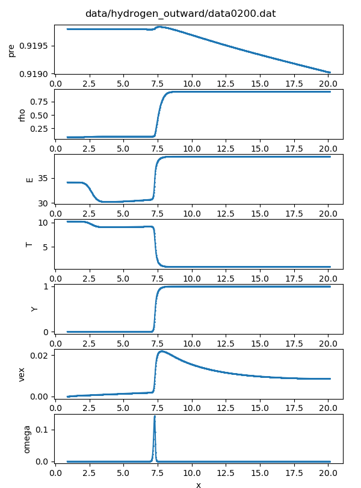
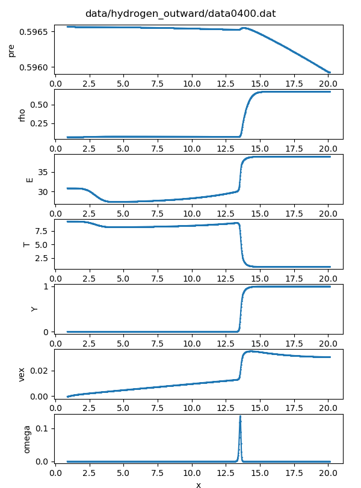
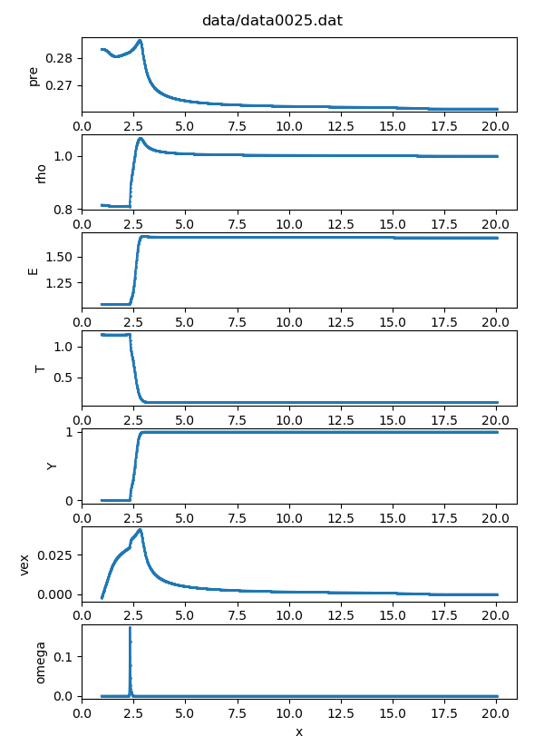
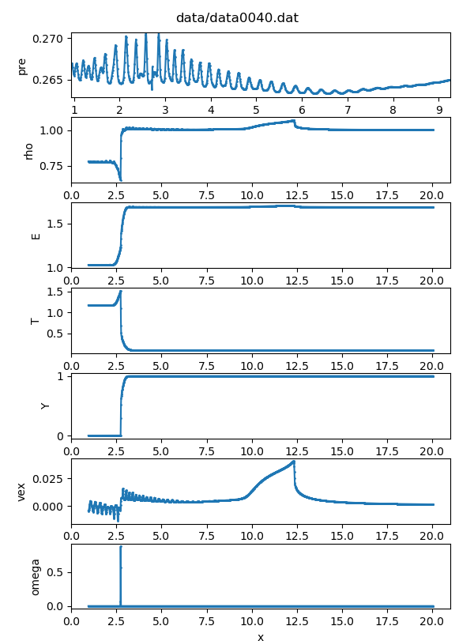

## Spherically Inward Propagating Flame of Type Ia Supernova

Supernova represent the catastrophic explosions that mark the end of the life of some stars. The ejected mass is of order 1 to 10 solar masses with bulk velocities ranging from a few thousand to a few tens of thousands of km/s.[^1] The traditional single Chandrasekhar mass C–O White Dwarf burning is still considered to be responsible for a large population of type Ia supernova (SN Ia). Specifically, one of the key issues in its modeling is related to the flame acceleration and deflagration-detonation transition (DDT), with flame front instabilities being considered as a possible mechanism in driving the acceleration. The perspective of this proposal is to give a set of solutions of this problem. The milestones of this project are planed to be:

​	(a) Complete a set of code that can solve the 1D Hydrogen-Oxygen flame.

​	(b) Complete a set of code that can solve the simplest reacting flow in SN Ia conditions.

​	(c) Try to observe spherical flame acceleration with large Lewis number curvature effect.

​	(d) Try to observe pulsation in Xing & Zhao's case.

​	(e) Try to observe deflagration-detonation transition (DDT) in (d).

For more details, please refer to [TheoryGuide.pdf](TheoryGuide.pdf)

### 1. Usage

Please refer to the [Makefile](Makefile) and input namelist in `src` directory.

### 2. Results

+ Outward Hydrogen-Oxygen flame ($t=220\mu s$ and $t=440\mu s$, compiled without `-Dsupernova` and use the input `src/input_hydrogen_outward.nml`), initial acceleration and curvature effects are observed in the detected flame speed.

   

+ Planar Supernova flame ($t=25$ and $t=40$), not sure for the correctness. The reaction rate coefficients, diffusivities and many other properties are unknown for sure. (compiled with `-Dsupernova` and use the input `src/input_supernova_planar.nml`).
  
  
  
  